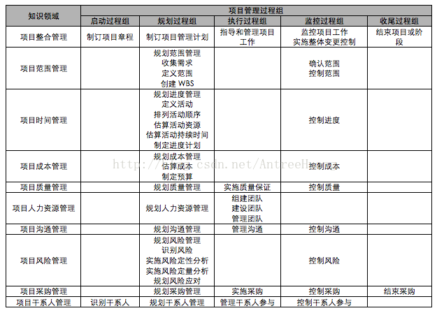
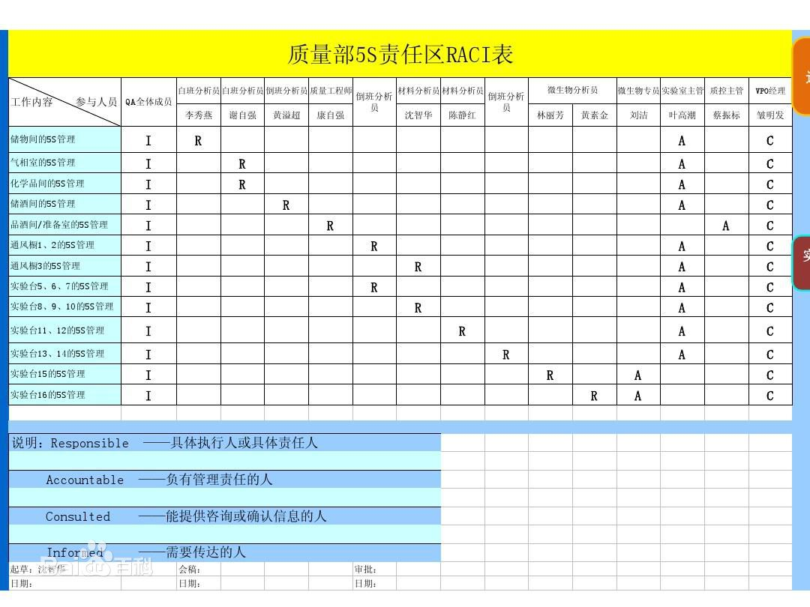
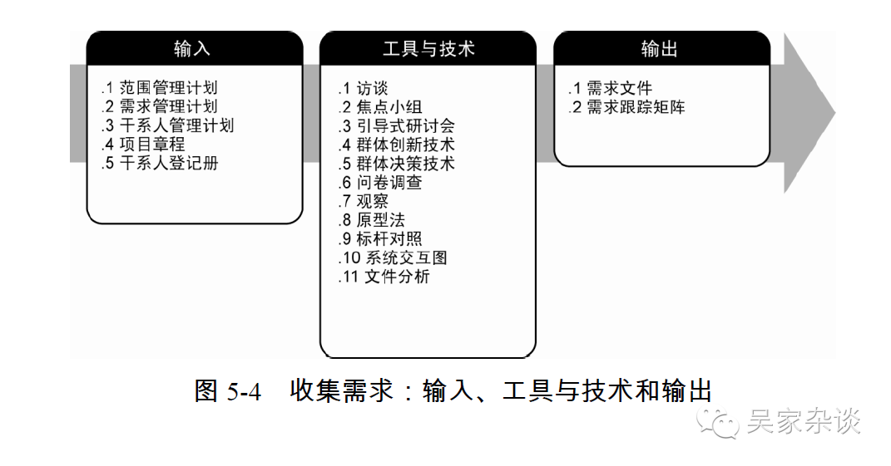
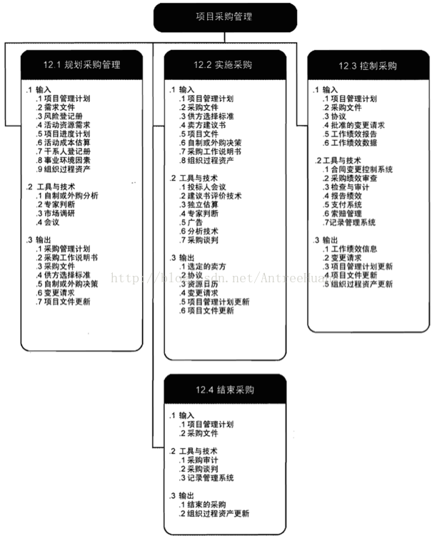
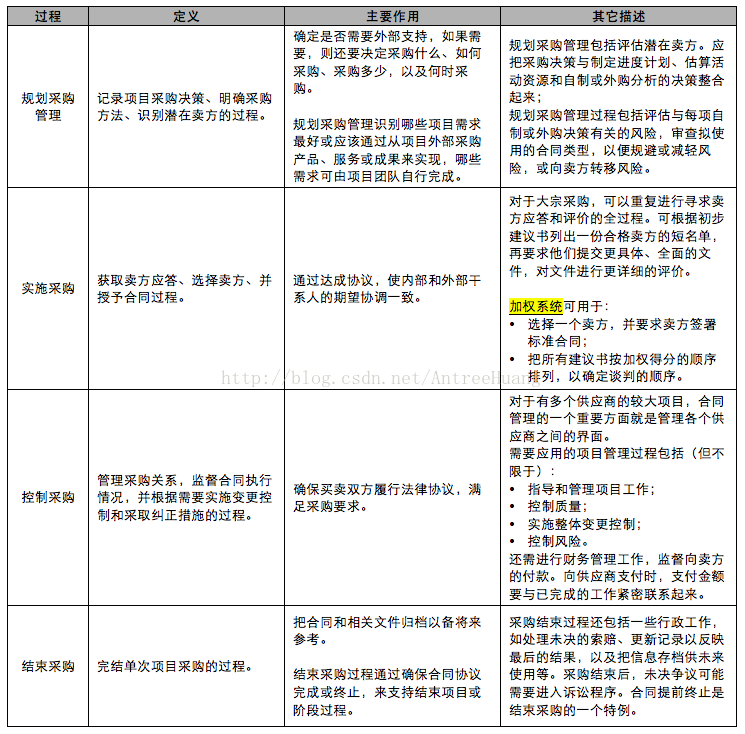

PV: Plan Value

BCWS: Budgeted Cost for Work Scheduled

PV=BCWS=计划工作量*预算定额

AC: Actual Cost

ACWP: Actual Cost for Work Performed

EV: Earned Value

BCWP: Budgeted Cost for Work Performed

EV=BCWP=已完成工作量*预算定额

CV: Cost Variance

SV: Schedule Variance

SV=EV-PV

CV=EV-AC

CPI: Cost Performed Index

CPI=EV/AC

SPI: Schedule Performed Index

SPI=EV/PV

BAC: Budget cost at completion

ETC: Estimate (or Estimated) To Complete

EAC: Estimate at completion

VAC: Variance at completion

EAC= AC+(BAC-EV) =BAC/CPI

ETC=EAC-AC

VAC=BAC-EAC

IRR: Internal Rate of Return 内部收益率
资金流入现值总额与资金流出现值总额相等、净现值等于零时的折现率

内部收益率有财务内部收益率(FIRR)和经济内部收益率(EIRR)之分

举例来说，如IRR为8%，可以简单解释为以8%的利率借钱投资于此项目，刚好可以不赚不赔。

NPV:net present value
净现值=未来报酬的总现值－初始投资现值。

RACI模型:
* 谁负责(R = Responsible),即负责执行任务的角色，他/她具体负责操控项目、解决问题。
* 谁批准(A = Accountable),即对任务负全责的角色，只有经他/她同意或签署之后，项目才能得以进行。
* 咨询谁(C = Consulted),拥有完成项目所需的信息或能力的人员。
* 通知谁 (I =Informed),即拥有特权、应及时被通知结果的人员，却不必向他/她咨询、征求意见。

需求分析过程:

* 焦点小组
> 由一位受过训练的主持人引导大家进行互动式讨论

* 引导式研讨会
> 跨职能需求和协调干系人差异的重要技术

团队发展阶段模型(Tuckman Stages of Team Development Model)
1. 组建期 (Forming)
2. 激荡期 (Storming)形成各种观念，激烈竞争、碰撞的局面。
3. 规范期 (Norming)规则，价值，行为，方法，工具均已建立。
4. 执行期 (Performing)人际结构成为执行任务活动的工具， 团队角色更为灵活和功能化，团队能量积聚于一体。
5. 休整期 (Adjourning) 任务完成，团队解散。

项目章程:
输入：
    1. 工作说明书SOW
    2. 商业论证
    3. 协议
    4. 事业环境因素
    5. 组织过程资产
工具&技术：
    1. 专家判断
    2. 引导技术
输出：
1. 项目章程

人力资源管理:
如何定义,配置,管理,遣散项目管理人员

人力配置管理:
说明将在何时,何种方式获得项目人员,并在项目中工作多久

团队组建技术:
* 预分配
* 谈判
* 招募
* 虚拟团队
* 多标准决策分析

估算成本：工具与技术
1. 专家判断
2. 类比估算
3. 参数估算
4. 自下而上估算
5. 三点估算
6. 储备分析
7. 质量成本(COQ)
8. 项目管理估算软件
9. 卖方投标分析

风险管理策略:
* 减轻 采用复杂性较低的流程，进行更多的测试，或者选用比较稳定的供应商
* 转移 外包 保险 <=> 分享
* 回避  <=> 开拓
* 接受

德尔菲法(Delphi method)
是采用背对背的通信方式征询专家小组成员的预测意见，经过几轮征询，使专家小组的预测意见趋于集中，最后做出符合市场未来发展趋势的预测结论。德尔菲法又名专家意见法或专家函询调查法。

解决冲突:
* 面对/解决问题(confronting/problem solving)
* 合作(collaborating) 得出一个多数人接受和承诺的冲突解决方案
* 妥协(compromising) 寻找能让所有当事人都在一定程度上满意的方案
* 缓解/包容(smoothing/accommodating)  求同存异
* 撤退/回避(withdrawing/avoiding)：
* 强迫(forcing)

SWOT分析法:
S (strengths）是优势、W (weaknesses）是劣势，O (opportunities）是机会、T (threats)

识别风险-工具与技术:
1. 文档审查
2. 信息收集技术
> 头脑风暴。
> 德尔菲技术。
> 访谈。
3. 核对表分析
4. 假设分析
5. 图解技术
6. SWOT 分析
7. 专家判断

采购:

